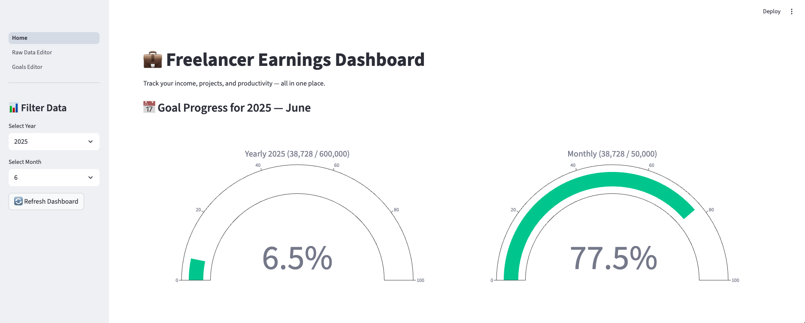
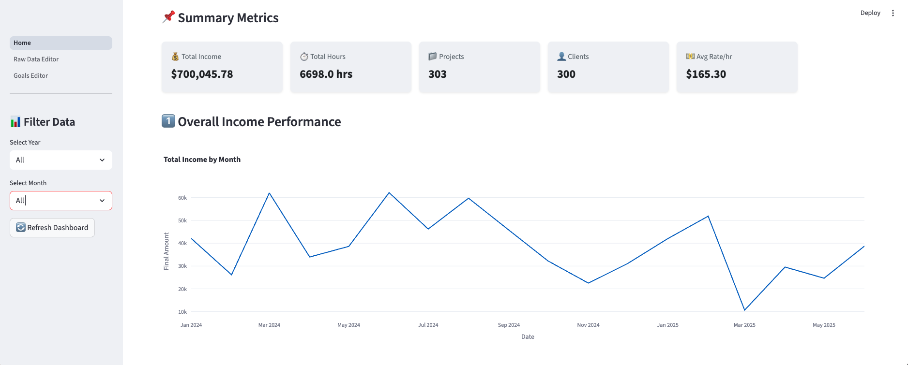
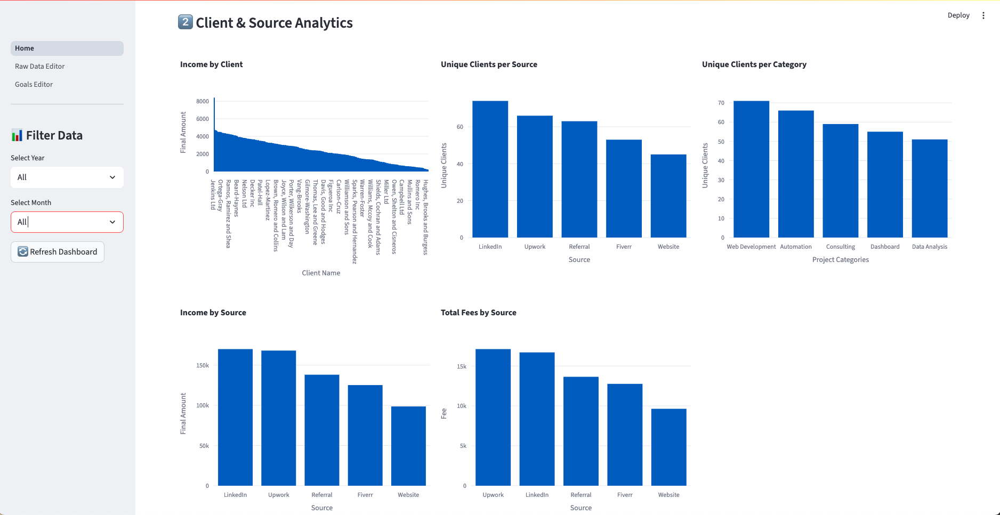
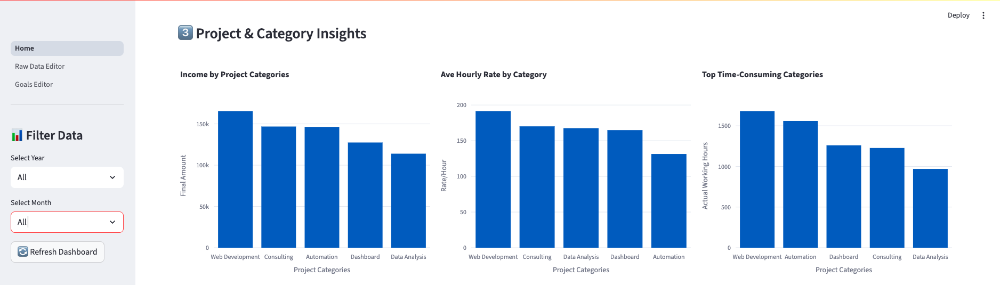
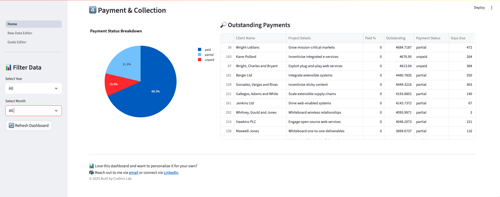
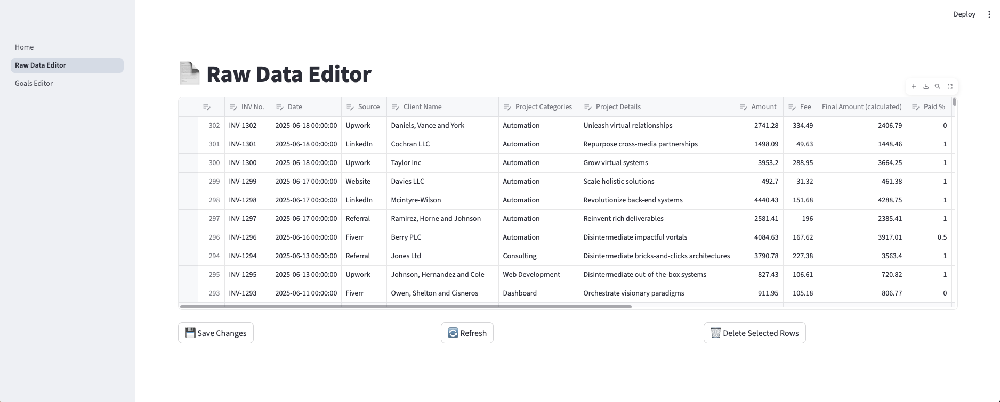
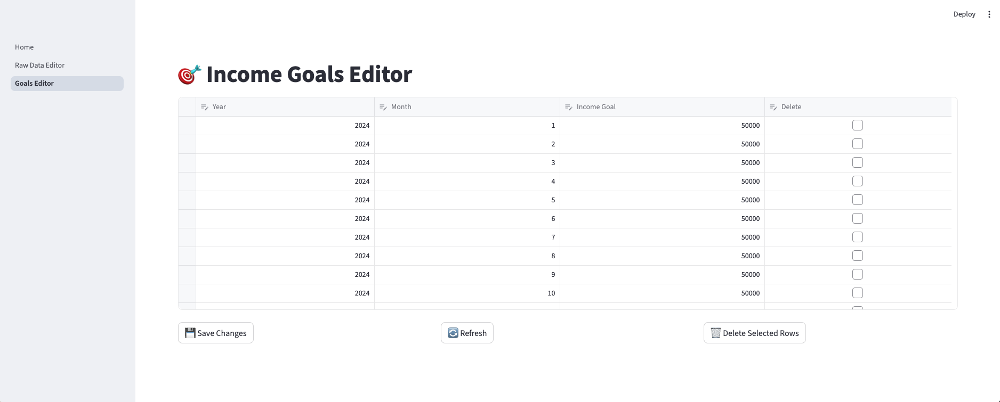

# 💼 Freelancer Earnings Dashboard

This dashboard helps you track your income, projects, working hours, and client analytics — all in one place!

It's built using [Streamlit](https://streamlit.io), a simple way to turn Python scripts into interactive web apps. No coding knowledge required to run it!

---

## 🚀 What You Can Do with This Dashboard

✅ View your total income over time  
✅ Track income goals and progress (monthly & yearly)  
✅ Analyze income by client, source, or project category  
✅ See your average hourly rate  
✅ Monitor unpaid and overdue invoices  

---
## 🖼️ What It Looks Like








---
## 📦 What You Need

To run this dashboard, you’ll need:

✅ A computer with:

- **Python** installed (version 3.8 or above)
- An internet connection to download some libraries

✅ Your own **freelance data Excel file**, or use the example one provided (`Raw Data.xlsx`)

---

## 🛠️ How to Set It Up (Step-by-Step)

### 1️⃣ Download the Files

Click the green `Code` button at the top of this page and choose `Download ZIP`.  
Then unzip it to a folder on your computer.

Or if you use Git:
```bash
git clone https://github.com/yourusername/freelancer-dashboard.git
cd freelancer-dashboard
```

### 2️⃣ Install Python (if not already)

If you don’t have Python, download it here and install it.
https://www.python.org/downloads/

### 3️⃣ Install Required Packages
Open your terminal or command prompt:

```bash
cd path/to/the/folder  # Go to the folder you just unzipped
pip install -r requirements.txt
```
This installs everything the dashboard needs to work.

### 4️⃣ Run the Dashboard 🎉
In the same folder, run:
```bash
streamlit run Home.py
```
A browser tab will open automatically with your dashboard!

### 📁 Using Your Own Data
To use your own freelance data:
1. Replace Raw Data.xlsx with your Excel file
2. Make sure your file has the same sheets and columns with the template.
3. You can also modify the app to accept file uploads. Let me know if you need help with that!

### 💡 Tips for Using the Dashboard
1. Use the filters on the left sidebar to select year/month
2. The gauges will show your goal progress for the selected month/year
3. The tables and charts will update automatically
4. Data is read from the Excel file every time you refresh the page

### 🧑‍💻 No Coding Required!
Once set up, all you need to do is:
1. Open your terminal
2. Run streamlit run app.py
3. Enjoy your dashboard!

### 🤝 Need Help or Customization?
If you’d like help customizing this dashboard, or want a version that works with Google Sheets, CSV files, or cloud databases — just reach out!

📧 msminyi@gmail.com

© 2025 Built with ❤️ by Codinci Lab